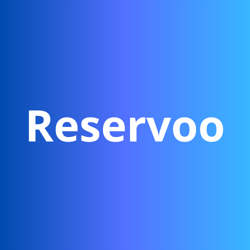

<div align="center">
    
</div>

# Restaurant Reservation System

Restaurant reservation system. Create an account, reserve a table at your favorite restaurants and write reviews.

## Installation and Setup

### Prerequisites

- **Docker** (for Laravel Sail setup)
- **PHP** ^8.2 (for local setup)
- **Composer** (for local setup)
- **Node.js** and **npm** (for local setup)
- **MySQL** (for local setup)

### Docker Setup with Laravel Sail

1. **Clone the repository**:
    ```bash
    git clone https://github.com/Vencelg/reservoo.git
    cd reservoo
    ```

2. **Copy the `.env.example` file to `.env`**:
    ```bash
    cp .env.example .env
    ```
3. **Install composer dependencies**:
    ```bash
    docker run --rm \
    -u "$(id -u):$(id -g)" \
    -v "$(pwd):/var/www/html" \
    -w /var/www/html \
    laravelsail/php83-composer:latest \
    composer install --ignore-platform-reqs
    ````

4. **Create Storage/framework folders if not present**:
    ```bash
    cd storage/
    mkdir -p framework/{sessions,views,cache}
    chmod -R 775 framework
    cd ..
    ````
   
5. **Start the docker containers**:
    ```bash
    ./vendor/bin/sail up -d
    ```
   
6. **Generate an application key**:
    ```bash
    ./vendor/bin/sail artisan key:generate
    ```

7. **Run database migrations and seeders**:
    - Sometimes the first migration attempt fails, so you have to run it twice.
    ```bash
    ./vendor/bin/sail artisan migrate:fresh --seed
    ```
8. **Install JavaScript dependencies**:
    ```bash
    ./vendor/bin/sail npm i
    ```

9. **Compile dependencies**:
    ```bash
    ./vendor/bin/sail npm run dev
    ```

10. **Access the application**:
     - Visit `http://localhost` in your browser.

### Local Setup

1. **Clone the repository**:
    ```bash
    git clone https://github.com/Vencelg/reservoo.git
    cd reservoo
    ```

2. **Copy the `.env.example` file to `.env`**:
    ```bash
    cp .env.example .env
    ```

3. **Install PHP dependencies**:
    ```bash
    composer install
    ```
   
4. **Create Storage/framework folders if not present**:
    ```bash
    cd storage/
    mkdir -p framework/{sessions,views,cache}
    chmod -R 775 framework
    cd ..
    ````
   
5. **Generate an application key**:
    ```bash
    php artisan key:generate
    ```

6. **Run database migrations and seeders**:
    ```bash
    php artisan migrate --seed
    ```

7. **Install JavaScript dependencies**:
    ```bash
    npm install
    ```
   
8. **Compile dependencies**:
    ```bash
    npm run dev
    ```

9. **Start the development server**:
    ```bash
    php artisan serve
    ```

10. **Access the application**:
    - Visit `http://localhost:8000` in your browser.

### User Accounts

- **Register your own user account**.
- **Use a premade user**:
    - **Email**: `jdoe@email.com`
    - **Password**: `password`

## Testing

To run tests, use the following commands:

### Using Laravel Sail

```bash
./vendor/bin/sail artisan test
```

### Locally

```bash
php artisan test
```
